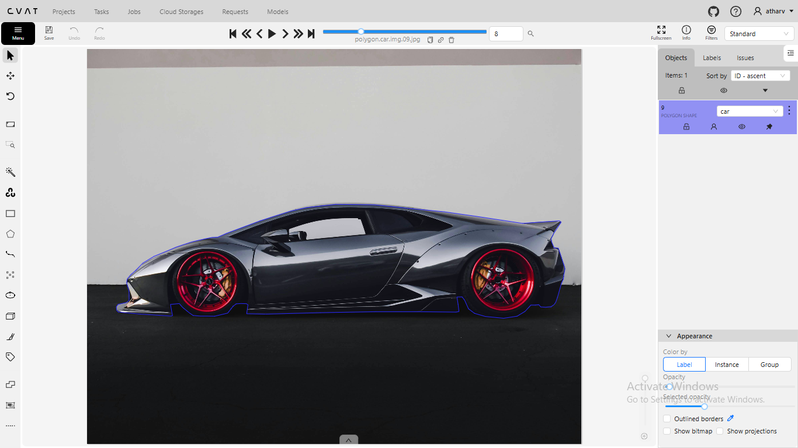
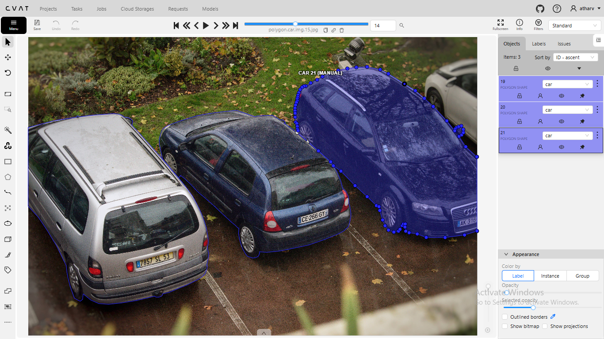
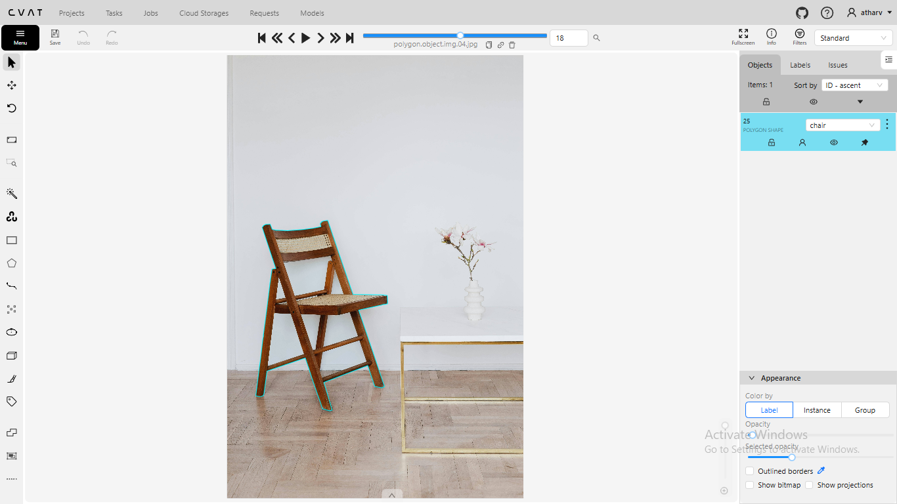
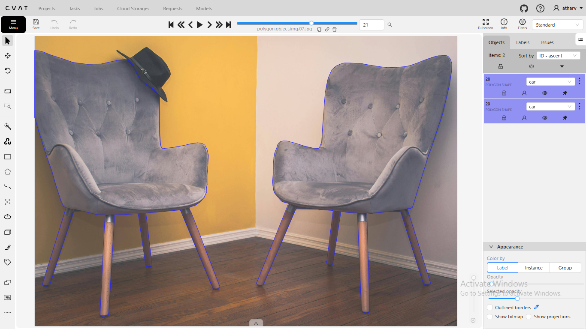
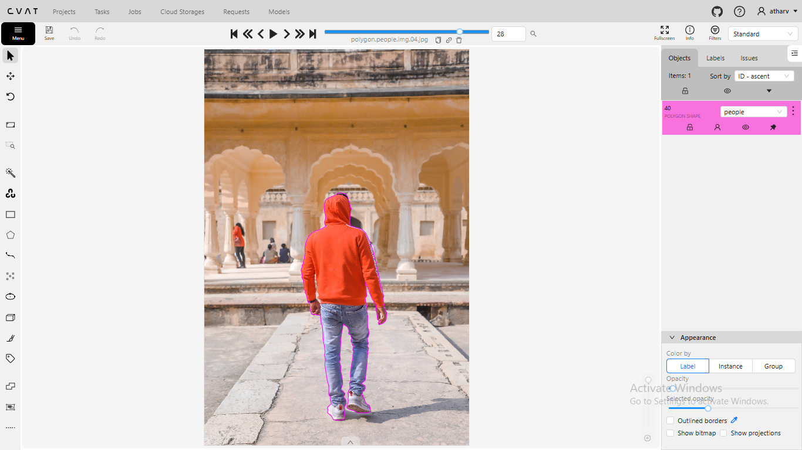
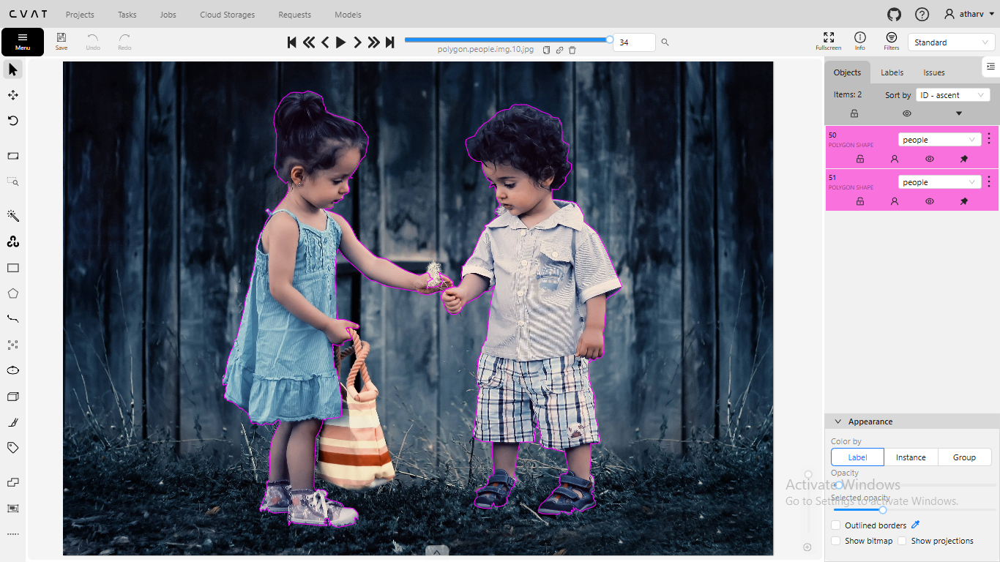

# Polygon-annotation-by-cvat
This repository shows the sample project of polygon annotation using cvat. There are 15 images of cars, 10 images of people and 10 images of chairs. It provides the the link to raw images, the annotation .txt file, and some screenshots of the project.  
Contact: atharvmane1118@gmail.com 
## Annotation 
[Download COCO JSON ](polygon.json.txt)  
## Raw Images
https://drive.google.com/drive/folders/178jLeK0CYFFJ4E-9azat60uyUDfMYlw8?usp=sharing
## Screenshots

